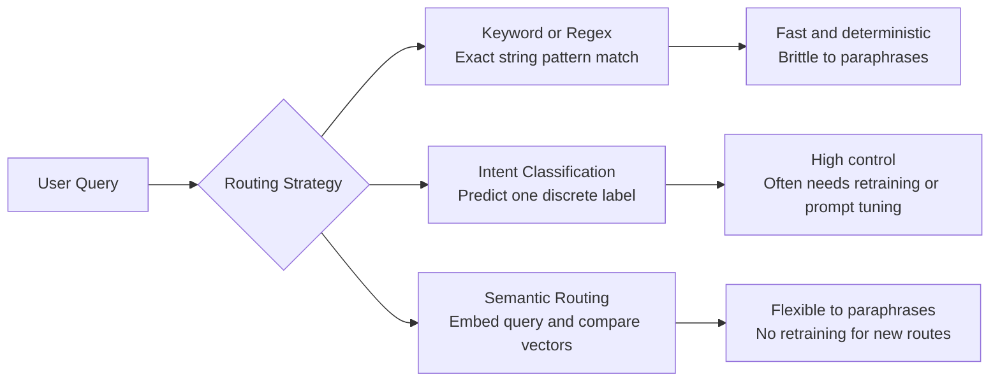
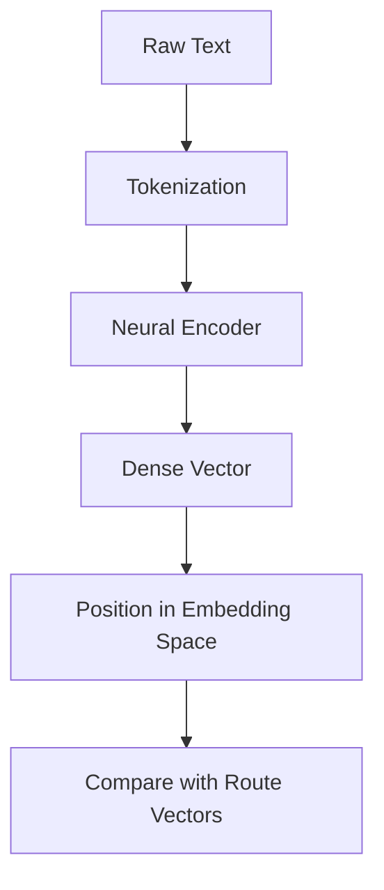
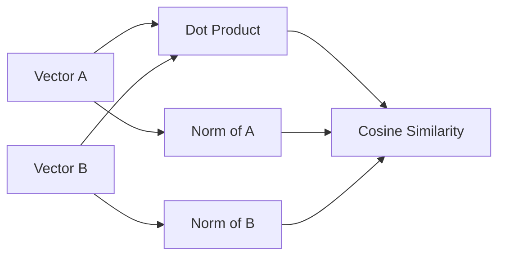
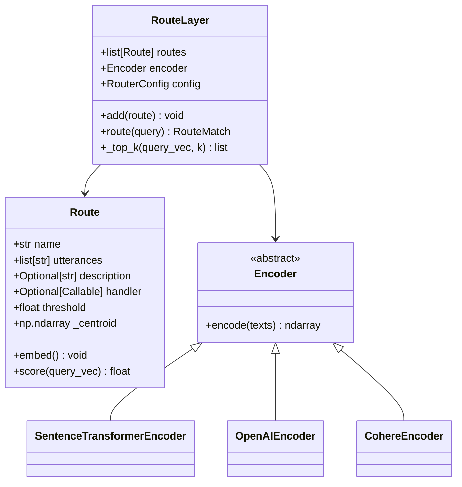
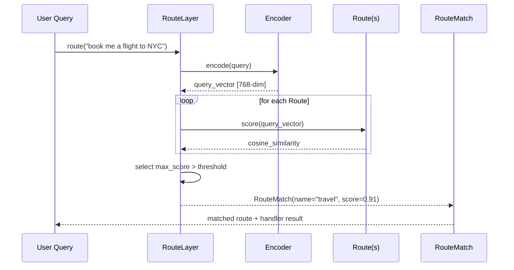
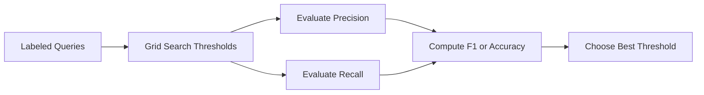
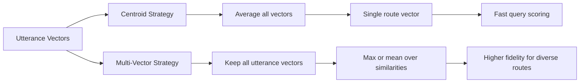
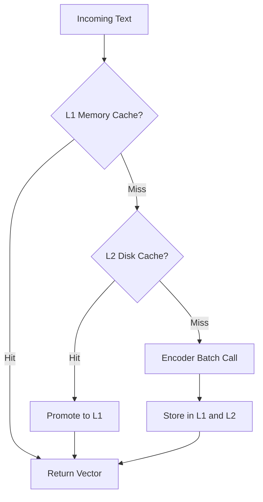

# Semantic Router Concepts

Semantic routing maps natural-language input to actions by comparing embeddings in vector space instead of relying on brittle keyword rules or a retrained classifier. This guide explains the concepts behind the reference implementation in this repository.

## 1.1 What Is a Semantic Router?

Semantic routing sits between rule-based routing and full intent classification.

- Keyword or regex routing matches explicit strings. It is cheap and deterministic, but it breaks when users rephrase the same request.
- Intent classification predicts one label from a fixed set, often using a fine-tuned model or an LLM prompt. It can work well, but it couples the system to retraining or prompt maintenance.
- Semantic routing embeds both route examples and user queries into the same vector space, then uses cosine similarity to find the closest route. Adding a new route usually means adding a few utterances rather than retraining a model.



ASCII fallback:

```text
USER QUERY
   |
   +--> KEYWORD/REGEX --------> exact string hit? --------> route
   |
   +--> INTENT CLASSIFIER ----> predict fixed label -------> route
   |
   +--> SEMANTIC ROUTER ------> embed + cosine similarity -> nearest route

Keyword routing: exact terms matter.
Intent classification: trained labels matter.
Semantic routing: meaning in vector space matters.
```

## 1.2 Vector Embeddings: From Words to Numbers

An embedding model converts text into a dense numeric vector. The model first tokenizes text into smaller pieces, processes those tokens through a neural network, and emits a fixed-size vector such as 384 or 768 floating-point values.

The key property is geometric: sentences with similar meaning often land near each other in high-dimensional space. That lets us compare meaning with a similarity metric instead of comparing exact words.

Mental model:

- A route is a region in embedding space.
- Example utterances define that region.
- A new query becomes a point.
- The router finds the nearest region above a confidence threshold.

ASCII projection:

```text
HIGH-DIM EMBEDDING SPACE (2D PCA projection)
━━━━━━━━━━━━━━━━━━━━━━━━━━━━━━━━━━━━━━━━━━

 1.0 │        ★ "book a flight"
     │      ★ "reserve a seat"         ● "weather today?"
 0.5 │    ★ "travel to Paris"       ● "will it rain?"
     │                        ◆ "play jazz music"
 0.0 │                      ◆ "shuffle my playlist"
     │
-0.5 │   △ "transfer money"
     │  △ "check my balance"
     └────────────────────────────────────
       -1.0   -0.5    0.0    0.5    1.0
        TRAVEL ←────────────→ MEDIA
```



ASCII fallback:

```text
"book me a flight"
        |
        v
   [tokenizer]
        |
        v
 [embedding model]
        |
        v
 [0.12, -0.08, 0.44, ..., 0.03]
        |
        v
 compare against stored route vectors
```

## 1.3 Cosine Similarity: The Core Distance Metric

Cosine similarity measures the angle between two vectors. For semantic routing, that usually matters more than raw Euclidean distance because embedding magnitude is often less informative than direction.

$$
\cos \theta = \frac{A \cdot B}{\|A\| \times \|B\|}
= \frac{\sum_i (A_i \times B_i)}{\sqrt{\sum_i A_i^2} \times \sqrt{\sum_i B_i^2}}
$$

Range: $[-1, 1]$. In practice, thresholds for normalized sentence embeddings often land around $0.75$ to $0.85$, but the right value depends on the route set and encoder.

Why cosine over Euclidean distance?

- In high-dimensional embeddings, vector direction often captures meaning better than raw magnitude.
- If embeddings are L2-normalized, cosine similarity becomes a simple dot product, which is fast.
- Euclidean distance can penalize magnitude differences that do not correspond to semantic difference.

Worked example:

Let $A = [1, 2, 2]$ and $B = [2, 1, 2]$.

1. Dot product: $A \cdot B = 1 \times 2 + 2 \times 1 + 2 \times 2 = 8$
2. Norm of $A$: $\|A\| = \sqrt{1^2 + 2^2 + 2^2} = \sqrt{9} = 3$
3. Norm of $B$: $\|B\| = \sqrt{2^2 + 1^2 + 2^2} = \sqrt{9} = 3$
4. Cosine similarity: $8 / (3 \times 3) = 8 / 9 \approx 0.8889$

Interpretation: the angle is small, so the semantic directions are similar.



ASCII fallback:

```text
      B
     /
    /
   / theta
  /
 O---------- A

Smaller angle -> higher cosine similarity -> stronger semantic match
```

## 1.4 Route Architecture

The implementation centers on four main abstractions:

- `Route`: a named intent with example utterances, metadata, and optional handler.
- `RouteLayer`: the routing engine that stores routes, uses an encoder, queries an index, and returns matches.
- `RouteMatch`: the result object returned when a route clears the decision threshold.
- `RouterConfig`: the operational configuration, including strategy, thresholds, and top-k behavior.



ASCII fallback:

```text
RouterConfig -------> RouteLayer <------- Encoder
                         |
                         |
                         +-------> Route
                         |
                         +-------> RouteMatch
```

## 1.5 Routing Decision Pipeline

The decision pipeline is deliberately simple:

1. Encode the user query.
2. Use the index to narrow candidates.
3. Score each candidate route.
4. Apply the best threshold.
5. Return the best route and optionally execute its handler.



ASCII fallback:

```text
query
  |
  v
encode -----------------> query vector
  |
  v
retrieve top-k candidates
  |
  v
score each route
  |
  v
best score > threshold ?
  | yes                     | no
  v                         v
RouteMatch              return None
```

## 1.6 Threshold Calibration

Threshold calibration controls the precision and recall trade-off.

- Higher threshold: fewer false positives, more false negatives.
- Lower threshold: more recall, but more spurious matches.

The library includes `RouteLayer.calibrate()` and `ThresholdCalibrator` to grid-search thresholds over a labeled dataset.

Example workflow:

1. Collect `(query, expected_route)` examples.
2. Sweep threshold values, for example from `0.10` to `0.99`.
3. Compute precision, recall, F1, or accuracy.
4. Choose the threshold that best fits the product objective.



ASCII fallback:

```text
precision
1.0 |\
    | \
    |  \
0.5 |   \
    |    \
0.0 +-----\---------->
      low   threshold  high

recall moves in the opposite direction as threshold increases
```

Calibration example:

```python
result = layer.calibrate(
    test_queries=[
        ("book me a flight", "travel"),
        ("will it rain tomorrow", "weather"),
        ("gibberish request", None),
    ],
    metric="f1",
)
```

## 1.7 Centroid vs. Multi-Vector Matching

There are two common strategies for representing a route.

Centroid approach:

- Embed all utterances.
- Average them into one representative vector.
- Fast and compact.
- Best when route examples form a tight semantic cluster.

Multi-vector approach:

- Keep every utterance vector.
- Score with max or mean similarity.
- More expressive, especially when a route covers multiple sub-patterns.
- More expensive at query time.



ASCII fallback:

```text
CENTROID
utt_1 --\
utt_2 ----> average --> one route vector --> one cosine score
utt_3 --/

MULTI-VECTOR
utt_1 ------> cosine(query, utt_1)
utt_2 ------> cosine(query, utt_2)
utt_3 ------> cosine(query, utt_3)
                | max / mean
                v
             route score
```

When each is better:

- Use centroid when routes are compact and latency matters.
- Use max when routes have diverse examples and you want strong nearest-neighbor behavior.
- Use mean when you want robustness to noisy utterances.

## 1.8 Caching and Performance

Embedding generation is usually the most expensive part of routing, so the implementation uses several performance techniques.

LRU caching:

- Repeated queries often recur.
- An in-memory LRU cache avoids recomputing hot embeddings.

Disk caching:

- Survives process restarts.
- Useful for large route sets or repeated evaluation jobs.

Batch encoding:

- Encoders are much faster on batches than single items.
- The library exposes batching helpers and uses them for route embedding.

Async support:

- Remote encoders benefit from concurrent requests.
- `async_route()` avoids blocking request handlers while waiting for network I/O.

Backend implications:

- Sentence-Transformers: lowest latency after warm-up, local execution, requires model download.
- OpenAI: high quality managed embeddings, network latency, billed per token.
- Cohere: similar remote trade-offs with different model choices.



ASCII fallback:

```text
query text
   |
   v
L1 cache? ---hit---> return
   |
  miss
   v
L2 cache? ---hit---> populate L1 -> return
   |
  miss
   v
encode in batch -> store -> return
```

## Closing Mental Model

The semantic router is a geometric decision system:

- Routes are example-defined semantic regions.
- Queries are vectors.
- Cosine similarity estimates semantic closeness.
- Thresholds turn closeness into a decision boundary.

That combination gives you a routing layer that is more flexible than keyword rules and lighter-weight than retraining an intent classifier for every change.