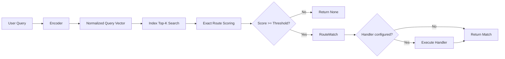

# Semantic Router

> Route user queries to handlers using vector similarity, without LLM calls and without retraining an intent classifier every time your routes change.

Semantic Router is a production-oriented reference implementation that combines:

- a typed Python library for semantic intent routing
- multiple encoder backends for local and remote embeddings
- a FastAPI server exposing route CRUD and inference endpoints
- threshold calibration utilities
- runnable examples and an end-to-end notebook walkthrough

## Hero Diagram

```text
┌──────────────┐    ┌──────────────────────┐    ┌────────────────────┐
│  User Query  │ -> │ Encoder -> Vector q  │ -> │ Similarity Search  │
└──────────────┘    └──────────────────────┘    └────────────────────┘
																													|
																													v
																								┌────────────────────┐
																								│ Best Route + Score │
																								└────────────────────┘
																													|
																													v
																								┌────────────────────┐
																								│ Optional Handler   │
																								└────────────────────┘
```

## Why Semantic Routing?

| Approach | How it decides | Strengths | Weaknesses | Best fit |
| --- | --- | --- | --- | --- |
| Keyword Router | Exact string or regex match | Deterministic, cheap, transparent | Brittle to paraphrases | Simple command grammars |
| Intent Classifier | Predict one label from a trained model or prompt | High control over fixed labels | Retraining or prompt maintenance | Stable intent taxonomies |
| Semantic Router | Compare embeddings with cosine similarity | Flexible, few-shot, easy to extend | Depends on encoder quality and calibration | Fast-moving product routing |

## Quick Install

```bash
pip install -e ".[dev]"
```

Optional extras:

```bash
pip install -e ".[openai]"
pip install -e ".[cohere]"
pip install -e ".[pinecone]"
pip install -e ".[all]"
```

## 30-Second Quickstart

```python
from semantic_router import Route, RouteLayer

layer = RouteLayer(
		routes=[
				Route(name="travel", utterances=["book a flight", "reserve a hotel"]),
				Route(name="weather", utterances=["will it rain tomorrow", "show the forecast"]),
				Route(name="music", utterances=["play some jazz", "shuffle my playlist"]),
		]
)

match = layer.route("book me a flight to Berlin")
print(match.to_dict() if match else {"matched": None})
```

First run with the default sentence-transformers encoder downloads `all-MiniLM-L6-v2`.

## Core Concepts

- Theory guide: [CONCEPTS.md](CONCEPTS.md)
- Library implementation: `semantic_router/`
- REST server: `api/`
- Runnable examples: `examples/`
- Notebook walkthrough: `notebooks/semantic_router_walkthrough.ipynb`

Core ideas covered in [CONCEPTS.md](CONCEPTS.md):

- what semantic routing is and how it differs from keywords and classification
- how embeddings map language into vector space
- why cosine similarity works well for normalized embeddings
- centroid versus multi-vector route scoring
- threshold calibration, caching, and performance trade-offs

## Architecture Overview



## API Reference

### Core Classes

#### `Route`

Represents one semantic destination.

| Field or Method | Parameters | Purpose |
| --- | --- | --- |
| `name` | `str` | Unique route identifier |
| `utterances` | `list[str]` | Example phrases that define the intent |
| `description` | `str | None` | Human-readable route summary |
| `handler` | `Callable | None` | Optional function executed on match |
| `threshold` | `float | None` | Route-specific threshold override |
| `metadata` | `dict[str, Any]` | Arbitrary tags or payload |
| `embed()` | `encoder: BaseEncoder` | Embeds utterances, stores vectors, computes centroid |
| `score()` | `query_vector: np.ndarray, strategy: str` | Scores query by centroid, max, or mean cosine |
| `to_dict()` | none | Serializes route state, including cached embeddings |
| `from_dict()` | `data: dict[str, Any]` | Rebuilds a route from serialized state |

#### `RouteLayer`

Main routing engine.

| Method | Parameters | Purpose |
| --- | --- | --- |
| `__init__()` | `routes`, `encoder`, `config`, `index` | Constructs the router and auto-embeds routes |
| `route()` | `query: str, include_scores: bool = False` | Routes one query and returns `RouteMatch | None` |
| `async_route()` | `query: str, include_scores: bool = False` | Async version for network-bound or concurrent use |
| `batch_route()` | `queries: list[str], include_scores: bool = False` | Routes many queries in one encode call |
| `score_all()` | `query: str` | Returns raw per-route similarity scores |
| `add()` | `route: Route` | Adds and embeds a new route |
| `remove()` | `name: str` | Deletes a route |
| `update()` | `route: Route` | Replaces an existing route |
| `get()` | `name: str` | Fetches a route by name |
| `list_routes()` | none | Lists current route names |
| `calibrate()` | `test_queries`, `metric` | Calibrates thresholds from labeled examples |
| `suggest_threshold()` | none | Suggests a threshold from route score distributions |
| `save()` | `path: str` | Saves configuration and route state to JSON |
| `load()` | `path: str` | Loads state from JSON |

#### `RouteMatch`

Structured response returned by the router.

| Field | Meaning |
| --- | --- |
| `name` | Matched route name |
| `score` | Best similarity score |
| `threshold` | Effective threshold used for the decision |
| `query` | Original user query |
| `metadata` | Metadata copied from the route |
| `handler_result` | Return value of the route handler, if any |
| `all_scores` | Optional score map across routes |

#### `RouterConfig`

Central place for defaults such as global threshold, `top_k`, strategy, batch size, and calibration sweep range.

#### `BaseEncoder`

Abstract contract for embedding backends.

| Method or Property | Purpose |
| --- | --- |
| `encode(texts)` | Returns `(N, D)` normalized embeddings |
| `encode_single(text)` | Convenience wrapper returning `(D,)` |
| `async_encode(texts)` | Async batch encoding |
| `dimensions` | Embedding dimensionality |
| `name` | Stable backend identifier used for logging and cache keys |

#### `ThresholdCalibrator`

Grid-searches thresholds for precision, recall, F1, or accuracy and returns `CalibrationResult` with the best global threshold, per-route thresholds, the calibration curve, and a confusion matrix.

### Utility Modules

| Module | Highlights |
| --- | --- |
| `semantic_router/utils.py` | cosine similarity, normalization, top-k selection, batched encoding |
| `semantic_router/cache.py` | two-level embedding cache with in-memory LRU and disk persistence |
| `semantic_router/index/local.py` | in-memory NumPy centroid index |
| `semantic_router/index/pinecone.py` | optional managed vector index backend |

### REST API

#### Route CRUD

| Endpoint | Description |
| --- | --- |
| `GET /routes` | List all route names, utterance counts, thresholds, and descriptions |
| `GET /routes/{name}` | Return full route detail |
| `POST /routes` | Create and embed a route |
| `PUT /routes/{name}` | Update route utterances, metadata, threshold, or handler path |
| `DELETE /routes/{name}` | Remove a route |
| `POST /routes/{name}/test` | Score one query against one route |

#### Query Endpoints

| Endpoint | Description |
| --- | --- |
| `POST /route` | Route one query |
| `POST /batch-route` | Route a batch of queries |
| `POST /embed` | Expose the current encoder as a REST embedding endpoint |
| `GET /calibrate/suggest` | Suggest a threshold from the loaded route distribution |
| `POST /save` | Save router state to disk |
| `POST /load` | Load router state from disk |
| `GET /health` | Service health check |
| `GET /docs` | Interactive OpenAPI UI |
| `GET /metrics` | Prometheus metrics endpoint |

## Configuration Guide

| `RouterConfig` option | Default | Meaning |
| --- | --- | --- |
| `default_threshold` | `0.78` | Fallback threshold when a route has no override |
| `top_k` | `5` | Number of centroid candidates to score exactly |
| `routing_strategy` | `"centroid"` | One of `centroid`, `max`, `mean` |
| `default_batch_size` | `32` | Default batch size for encoder helpers |
| `calibration_min_threshold` | `0.10` | Lower bound for threshold search |
| `calibration_max_threshold` | `0.99` | Upper bound for threshold search |
| `calibration_steps` | `90` | Number of thresholds evaluated during calibration |
| `cache_enabled` | `True` | Enables cache-aware encoder paths when a cache exists |

Recommended starting points:

- Tight route clusters with many examples: `routing_strategy="centroid"`
- Broad route semantics with heterogeneous phrasing: `routing_strategy="max"`
- Precision-sensitive production paths: start around `default_threshold=0.82`
- Recall-sensitive assistants: start around `default_threshold=0.72`

## Encoder Backends

| Backend | Class | Typical dimensions | Strengths | Trade-offs |
| --- | --- | --- | --- | --- |
| Local sentence-transformers | `SentenceTransformerEncoder` | 384 to 1024 | Low latency after warm-up, no network per request | Requires local model download |
| OpenAI embeddings | `OpenAIEncoder` | 1536 or 3072 | Managed quality, easy ops | Network latency and per-token cost |
| Cohere embeddings | `CohereEncoder` | 1024 | Strong multilingual and retrieval use cases | Network latency and API dependency |

Setup notes:

- Local: install base dependencies and let the router download `all-MiniLM-L6-v2` on first use.
- OpenAI: install `.[openai]` and export `OPENAI_API_KEY`.
- Cohere: install `.[cohere]` and export `COHERE_API_KEY`.
- Pinecone: install `.[pinecone]` and pass a `PineconeIndex` into `RouteLayer`.

## Production Deployment

The repository includes a multi-stage [Dockerfile](Dockerfile) that:

- installs the project in a builder image
- pre-downloads the default sentence-transformers model at build time
- copies artifacts into a slim runtime image
- runs the API as a non-root user on port `8000`

Build and run:

```bash
docker build -t semantic-router .
docker run --rm -p 8000:8000 semantic-router
```

Example `docker-compose.yml` snippet:

```yaml
services:
	semantic-router:
		build: .
		ports:
			- "8000:8000"
		environment:
			SEMANTIC_ROUTER_CORS_ORIGINS: "http://localhost:3000"
			OPENAI_API_KEY: "${OPENAI_API_KEY:-}"
			COHERE_API_KEY: "${COHERE_API_KEY:-}"
```

Important environment variables:

| Variable | Purpose |
| --- | --- |
| `SEMANTIC_ROUTER_CORS_ORIGINS` | Comma-separated CORS allowlist |
| `OPENAI_API_KEY` | Enables the OpenAI embedding backend |
| `COHERE_API_KEY` | Enables the Cohere embedding backend |

## Performance Benchmarks

Illustrative latency profile for a warm router. Treat these as directional expectations, not guaranteed numbers for your hardware or network path.

| Route count | Local ST encoder | OpenAI encoder | Main bottleneck |
| --- | --- | --- | --- |
| `10` | `7-15 ms` | `180-320 ms` | Remote network latency dominates OpenAI |
| `100` | `9-18 ms` | `190-340 ms` | Local scoring still cheap; remote call unchanged |
| `1000` | `14-30 ms` | `210-380 ms` | Candidate retrieval and exact scoring start to matter |

Use the notebook and example scripts to reproduce a benchmark profile on your own machine.

## Calibration Guide

Calibration prevents a semantic router from being either too eager or too hesitant.

```python
from semantic_router import ThresholdCalibrator

calibrator = ThresholdCalibrator(layer)
result = calibrator.calibrate(
		labeled_queries=[
				("book me a flight", "travel"),
				("will it rain tomorrow", "weather"),
				("nonsense blorb phrase", None),
		],
		metric="f1",
)

print(result.best_global_threshold)
print(result.summary())
```

Recommended workflow:

1. Collect real user queries plus the intended route or `None`.
2. Run grid search with `metric="f1"` first.
3. Inspect false positives and false negatives.
4. Raise thresholds for routes that overfire.
5. Lower thresholds for routes that underfire.

## FAQ

**Do I need to fine-tune a model?**

No. Most routing tasks work by defining good utterances per route and choosing the right threshold.

**When should I use `max` instead of `centroid` scoring?**

Use `max` when one route covers multiple distinct phrasings that should not collapse into one tight cluster.

**Can I attach handlers?**

Yes. Programmatic routes can pass a callable directly. The API also supports a `module:function` handler path.

**How do I scale beyond one process?**

Persist route state with `save()`, use the disk cache, and swap the default `LocalIndex` for `PineconeIndex` if route volume grows.

## Contributing

Typical local workflow:

```bash
pip install -e ".[dev]"
ruff check .
mypy semantic_router api --strict
pytest
```

The project is designed as a teaching reference, so contributions should keep code paths small, typed, and heavily documented.

## License

This project is intended to be distributed under the Apache 2.0 license.
